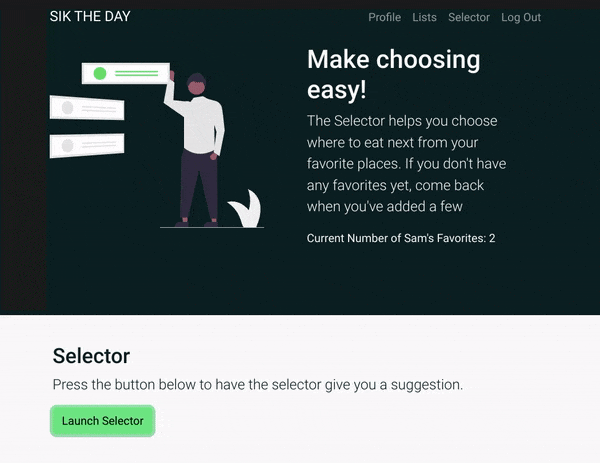

# Sik the Day
This app lets you rate restaurants and keep track of which ones rock.The Selector feature will help you choose where to eat based on your favorites. 

**Link to project:** https://siktheday.herokuapp.com/

## How It's Made:

**Tech used:** MongoDB, Express, Node, Javascript, Bootstrap, HTML, CSS

## Optimizations

Would like to add the ability to sort rated places based on various factors as well as a way to easily mark or unmark favorites. Also looking to add a feed that will display user's public posts.

## Lessons Learned:

With the MVC structure of this app, I've gained a better understanding of what information controllers need to have in order to serve views the correct data needed to render the page.